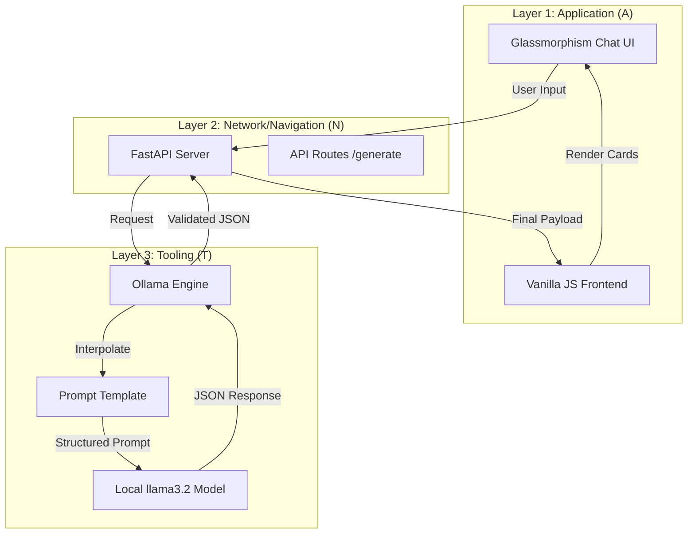

# 🚀 Local LLM TestCase Generator (B.L.A.S.T. Framework)

A premium, local-first test case generator powered by **Ollama** and **FastAPI**. This project uses the **B.L.A.S.T.** (Blueprint, Link, Architect, Stylize, Trigger) protocol to ensure deterministic and high-quality QA outputs using the `llama3.2` model.

---

## 📊 System Architecture

The project follows a **3-Layer A.N.T. Architecture** to separate concerns and ensure reliability:



---

## ✨ Key Features

- **Local Execution**: No data leaves your machine. Uses Ollama for private LLM processing.
- **Glassmorphism UI**: A premium, dark-themed interface with smooth micro-animations.
- **Structured Output**: Generates test cases in a rigorous format including Title, Steps, Priority, and Expected Results.
- **Deterministic Logic**: Uses system-level prompt templates to minimize AI hallucinations.

---

## 🛠️ Technology Stack

- **Backend**: Python (FastAPI)
- **Library**: `ollama-python`
- **Frontend**: HTML5, Vanilla CSS (Custom Glassmorphism), JavaScript
- **Model**: `llama3.2:1b`

---

## 🚀 Getting Started

### Prerequisites
1.  **Ollama**: Install from [ollama.com](https://ollama.com) and ensure it's running.
2.  **Model**: Pull the model:
    ```bash
    ollama pull llama3.2:1b
    ```
3.  **Python**: Ensure Python 3.10+ is installed.

### Installation & Run

1.  **Clone the Repository**:
    ```bash
    git clone https://github.com/atulsingh9936/LocalTestCaseGenerator.git
    cd LocalTestCaseGenerator
    ```

2.  **Install Dependencies**:
    ```bash
    pip install fastapi uvicorn ollama
    ```

3.  **Launch the App**:
    ```bash
    python app.py
    ```

4.  **Open in Browser**:
    Navigate to [http://localhost:8000](http://localhost:8000)

---

## 📂 Project Structure

- `app.py`: The Navigation layer (FastAPI server).
- `tools/ollama_engine.py`: The Tooling layer (Ollama integration).
- `static/`: The Application layer (HTML/CSS/JS).
- `architecture/`: Technical SOPs and design logic.
- `gemini.md`: Project constitution and data schemas.

---

## 🛡️ License
MIT License. Created with ❤️ using the B.L.A.S.T. Framework.
